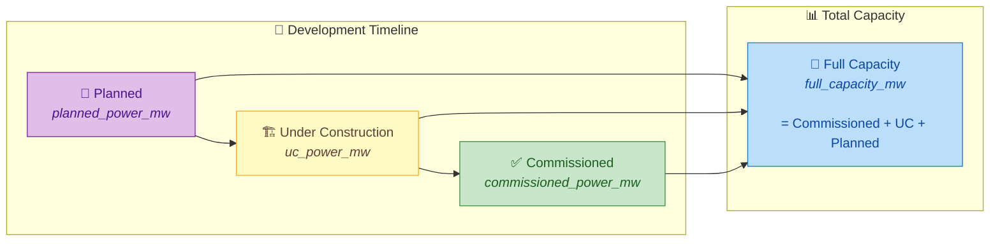
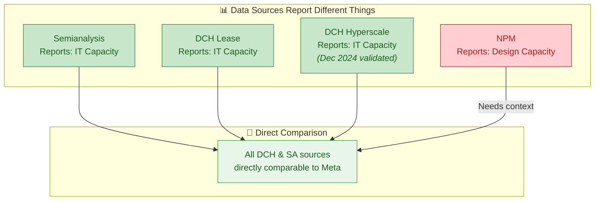
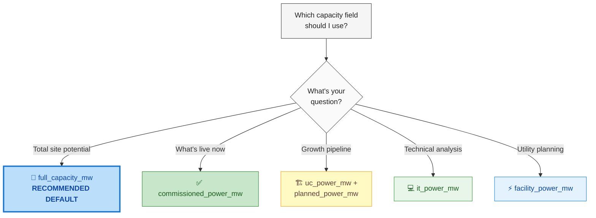
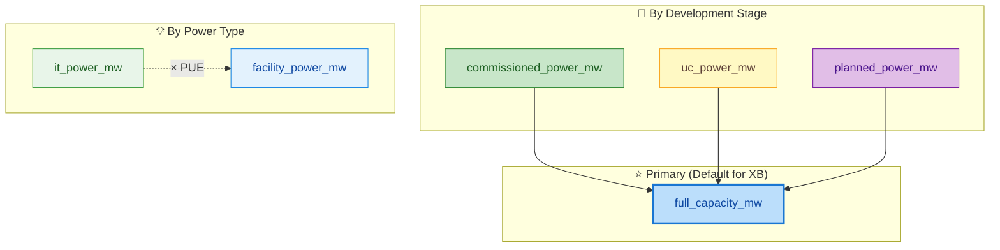
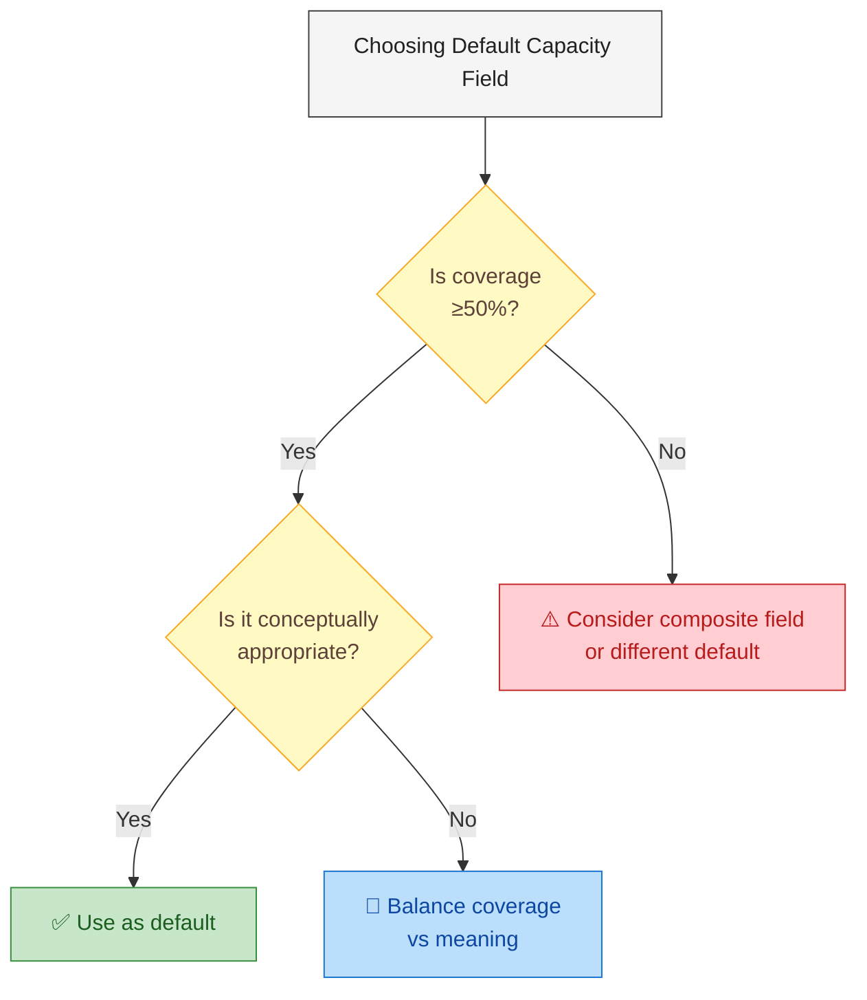

# Data Center Capacity Concepts

## Overview

Data center capacity can be measured in multiple ways, each serving different analytical purposes.

---

## 1. Time-Based Capacity (Development Stage)



| Field | Status | Example | Use Case |
|-------|--------|---------|----------|
| `planned_power_mw` | Announced, permits filed | 50 MW | Future pipeline |
| `uc_power_mw` | Actively building | 30 MW | Construction tracking |
| `commissioned_power_mw` | Operational today | 100 MW | Current state analysis |
| `full_capacity_mw` | Total potential | 180 MW | **Investment analysis** ⭐ |

---

## 2. Power Type (What's Being Measured)

> **Note:** The `it_power_mw` and `facility_power_mw` fields have been **removed from the schema**.
> The data already exists in `commissioned_power_mw` - use the `source` field to interpret:
> - **Semianalysis, DCH Lease, DCH Hyper** → All report IT Power (directly comparable to Meta)
>
> **December 2024 Finding:** Testing confirmed DCH reports IT capacity, NOT facility power. No PUE adjustment needed.
> See `CAPACITY_FIELD_DEFINITIONS.md` for detailed source-specific guidance.

```mermaid
flowchart TB
    subgraph Facility["🏢 Total Facility Power"]
        FP["Facility Power<br/><i>DCH Hyper reports this</i>"]
    end

    subgraph Components["Power Components"]
        IT["💻 IT Power<br/><i>Semianalysis & DCH Lease report this</i><br/>Servers, storage, network"]
        COOL["❄️ Cooling<br/><i>~30-40% of IT</i>"]
        INFRA["⚡ Infrastructure<br/><i>UPS, lighting, etc.</i>"]
    end

    IT --> FP
    COOL --> FP
    INFRA --> FP

    subgraph PUE["📐 PUE Relationship"]
        FORMULA["PUE = Facility Power ÷ IT Power<br/><br/>Typical: 1.2 - 1.5<br/>Efficient: < 1.2"]
    end

    FP -.-> FORMULA
    IT -.-> FORMULA

    style IT fill:#c8e6c9,stroke:#388e3c,color:#1b5e20
    style FP fill:#bbdefb,stroke:#1976d2,color:#0d47a1
    style COOL fill:#e1f5fe,stroke:#0288d1,color:#01579b
    style INFRA fill:#fff8e1,stroke:#ffa000,color:#5d4037
    style FORMULA fill:#fff3e0,stroke:#ef6c00,color:#e65100
```



| Source | Reports | How to Interpret `commissioned_power_mw` |
|--------|---------|------------------------------------------|
| Semianalysis | IT Capacity | Use directly - comparable to Meta |
| DCH Lease | IT Capacity | Use directly - comparable to Meta |
| DCH Hyper | IT Capacity | Use directly - comparable to Meta (Dec 2024 validated) |
| NPM | Design Capacity | Full buildout only - not status-split |

---

## 3. Source Data Variations



---

## 4. Recommended Default Field



---

## 5. Complete Field Hierarchy



---

## Summary Table

| Field | Category | Default? | Best For |
|-------|----------|----------|----------|
| **`full_capacity_mw`** | Timeline | ⭐ **YES** | Investment, comparison, total potential |
| `commissioned_power_mw` | Timeline | Alternate | Current operations, live capacity |
| `uc_power_mw` | Timeline | No | Construction pipeline |
| `planned_power_mw` | Timeline | No | Future growth analysis |

> **Note:** `it_power_mw` and `facility_power_mw` were **removed** from the schema.
> Use the `source` field + `CAPACITY_FIELD_DEFINITIONS.md` to interpret power type.

---

## ⚠️ Coverage Considerations

**Important:** The "best" default field also depends on **data coverage** - how many records actually have values populated.

Run the coverage analysis script to see actual population rates:
```python
exec(open(r"...scripts/04_validation/analyze_capacity_coverage.py", encoding='utf-8').read())
```

### Coverage by Source (from CAPACITY_FIELD_DEFINITIONS.md)

| Source | commissioned | full_capacity | Notes |
|--------|-------------|---------------|-------|
| **Semianalysis** | ✅ 69.6% | ✅ 91.8% | Also has mw_2023-2032; reports IT capacity |
| **DCH Hyper** | ✅ 60.1% | ✅ 94.6% | Reports IT capacity (Dec 2024 validated) |
| **DCH Lease** | ✅ 60.1% | ✅ 94.6% | Reports IT capacity |
| **DCM** | ⚠️ 28.5% | ⚠️ 32.5% | No hyperscaler capacity |
| **NPM** | ❌ 0% | ✅ 52.8% | Only populates full_capacity |

### Recommendation



---

## Formula Reference

```
full_capacity_mw = commissioned_power_mw + uc_power_mw + planned_power_mw

facility_power_mw = it_power_mw × PUE

PUE (Power Usage Effectiveness) = Total Facility Power ÷ IT Power
   • Industry average: 1.5 - 1.8
   • Good: 1.2 - 1.4
   • Excellent: < 1.2
```

---

*Created: January 2, 2026*
