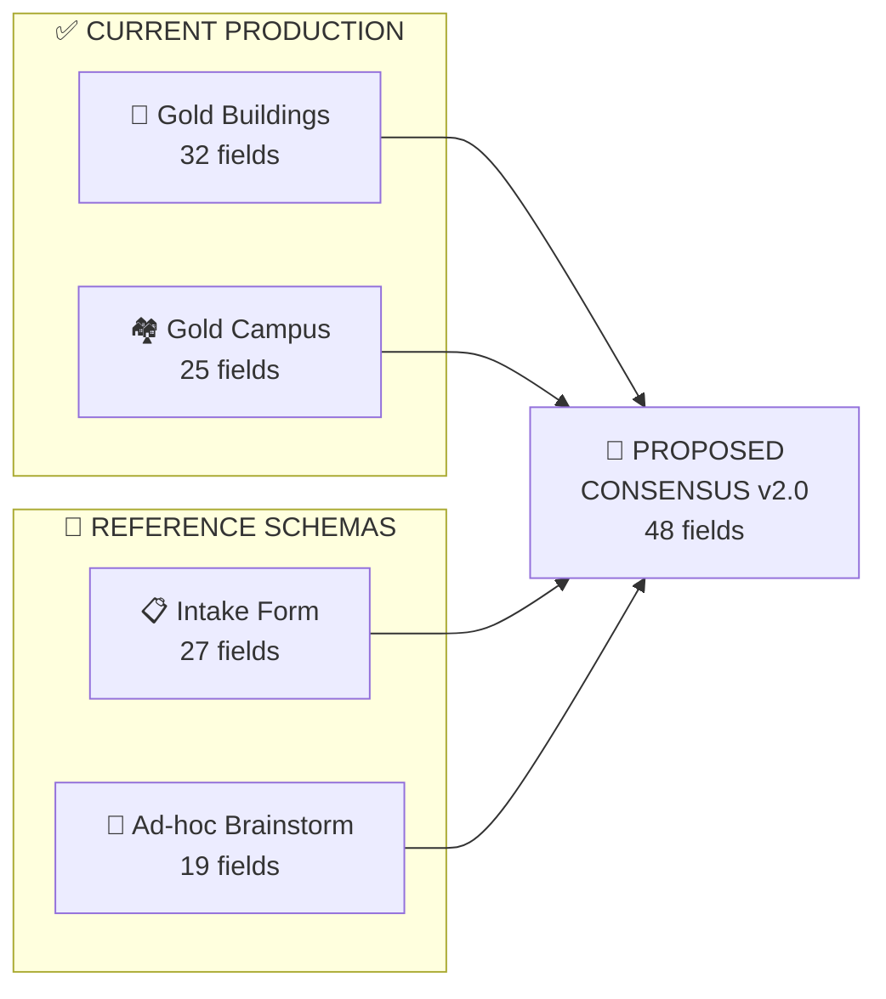
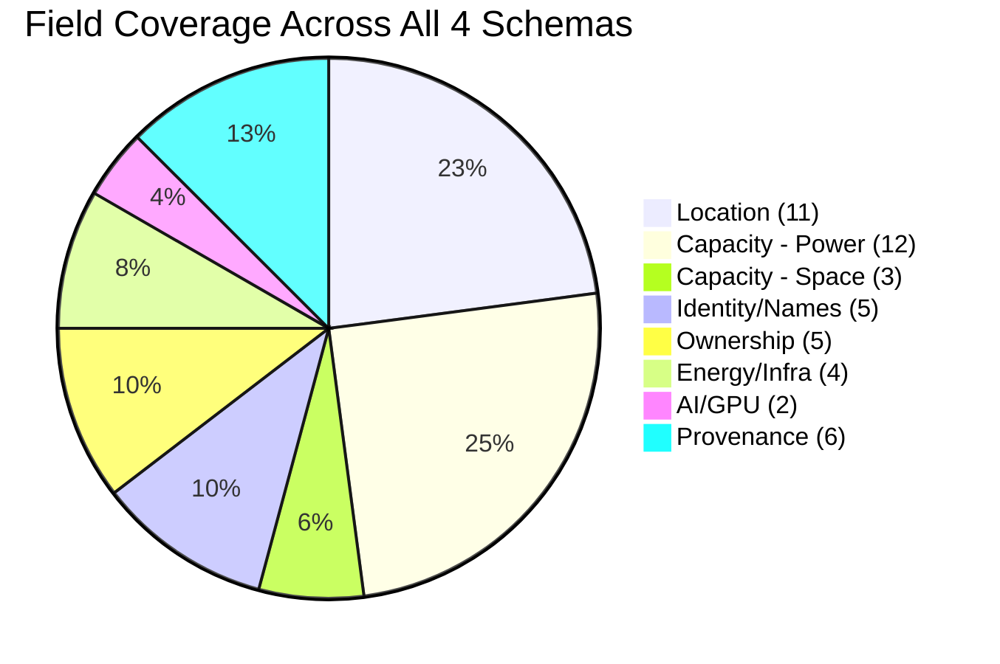
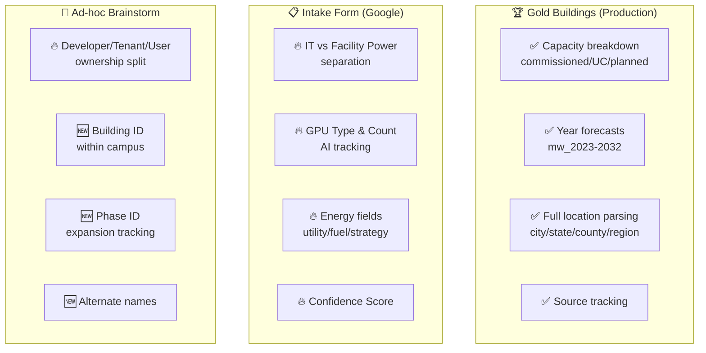
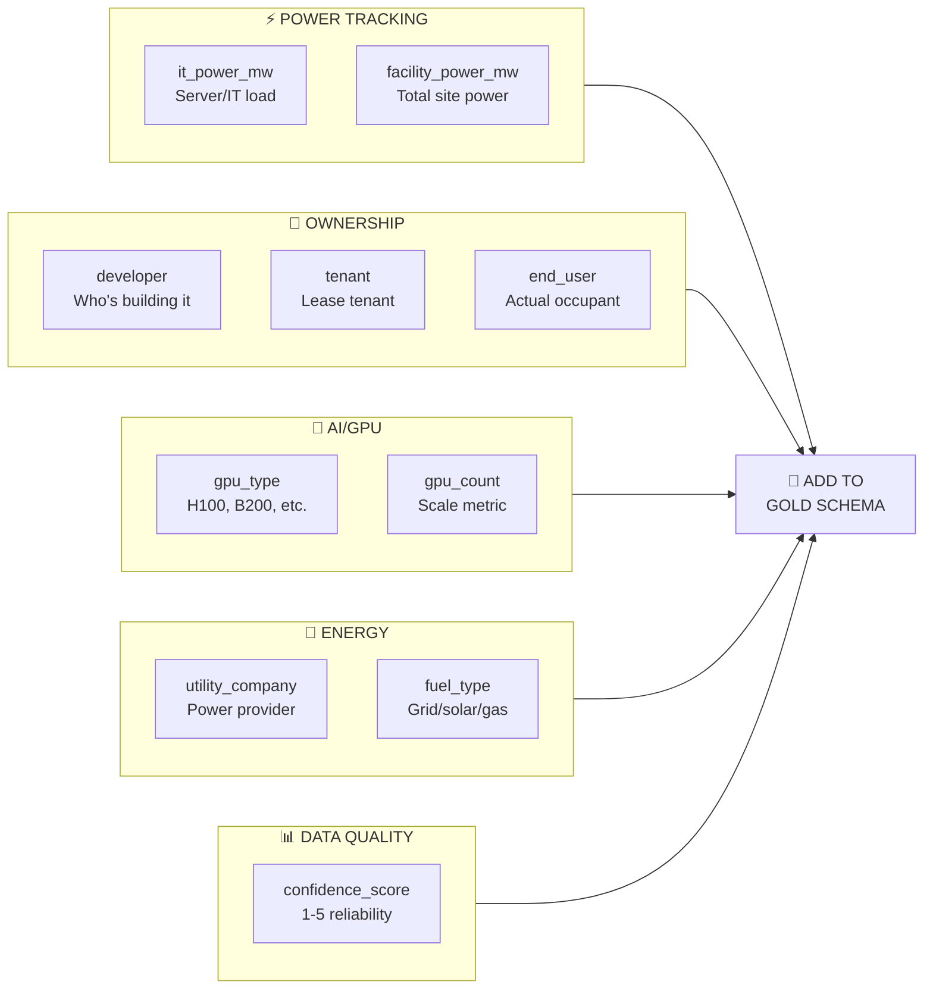
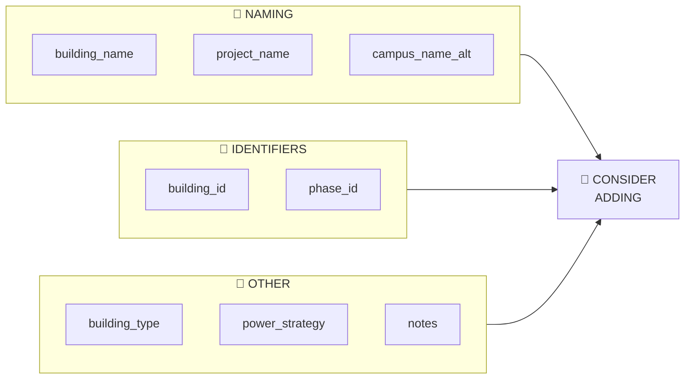
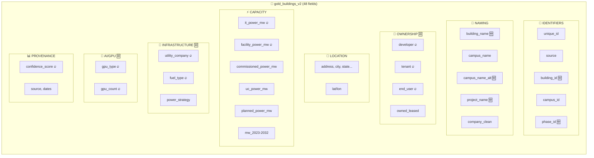
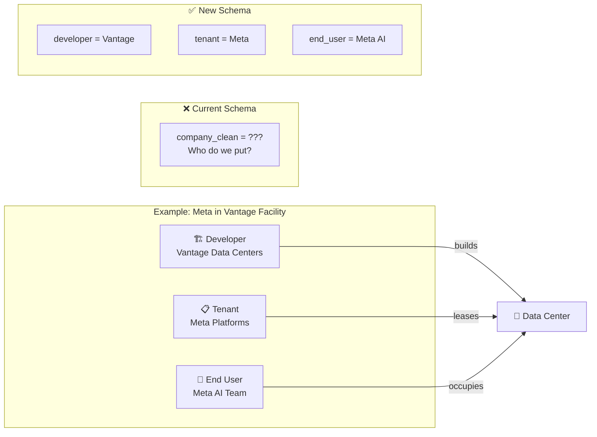
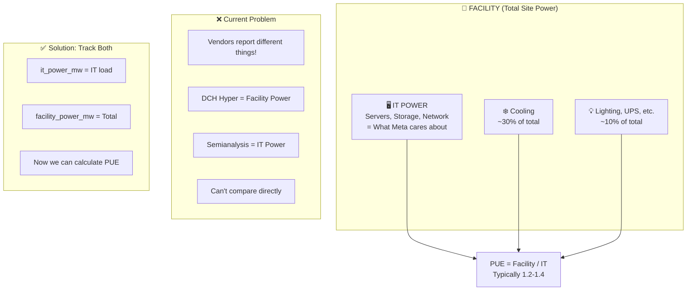
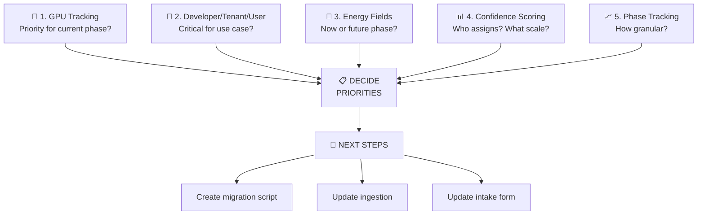
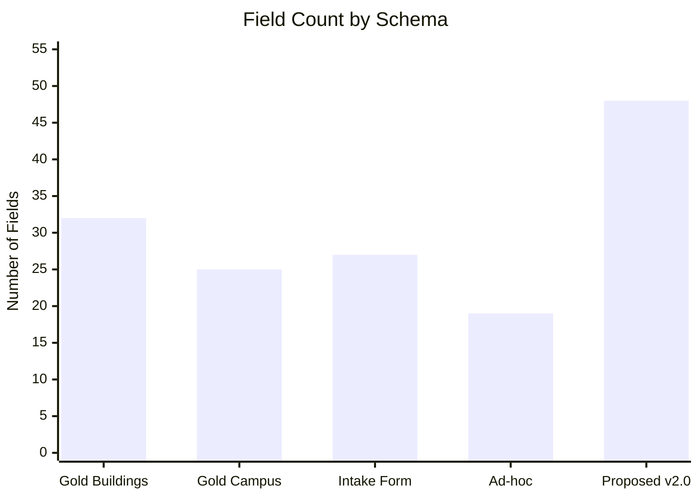

# 📊 Schema Comparison — Visual Guide

**For Supervisor Review**
**Created:** December 29, 2024

---

## 🔍 4 Schema Sources Compared

---

## 📋 Field Coverage by Category

---

## ✅ What Each Schema Does Well

---

## 🔥 HIGH PRIORITY: Fields to Add

---

## 🆕 MEDIUM PRIORITY: Nice to Have

---

## 🏗️ Proposed Schema v2.0 Structure

---

## 🔄 Ownership Model Explained

---

## ⚡ IT Power vs Facility Power

---

## ❓ Questions for Supervisor

---

## 📊 Field Count Summary

---

## 🎯 TL;DR — Key Recommendations

| Priority | Add These Fields | Why |
|----------|------------------|-----|
| 🔥 HIGH | `it_power_mw`, `facility_power_mw` | Enable accurate capacity comparison |
| 🔥 HIGH | `developer`, `tenant`, `end_user` | Track ownership chain |
| 🔥 HIGH | `gpu_type`, `gpu_count` | AI datacenter tracking |
| 🔥 HIGH | `utility_company`, `fuel_type` | Power planning & sustainability |
| 🔥 HIGH | `confidence_score` | Data quality tracking |
| 🆕 MED | `building_name`, `building_id` | Multi-building campus tracking |
| 🆕 MED | `project_name`, `phase_id` | Expansion tracking |

---

*Visual guide created December 29, 2024*
