# 🗺️ Universal Campus ID (UCID) — Visual Summary

**Purpose:** Link the same physical campus across multiple vendor data sources
**Last Updated:** February 11, 2026
**Status:** ✅ TIGHT (250m) Implemented

---

## 📚 Related Documents

| Document | Purpose |
|----------|---------|
| [UCID_DESIGN.md](../workflows/UCID_DESIGN.md) | Full design specification |
| [MATCH_CONFIDENCE_ANALYSIS.md](../workflows/MATCH_CONFIDENCE_ANALYSIS.md) | Match validation strategies |
| [SA_DCH_METHODOLOGY_RECOMMENDATIONS.md](../workflows/SA_DCH_METHODOLOGY_RECOMMENDATIONS.md) | Comparison methodology |

---

## 1. The Problem: Fragmented Campus Identity

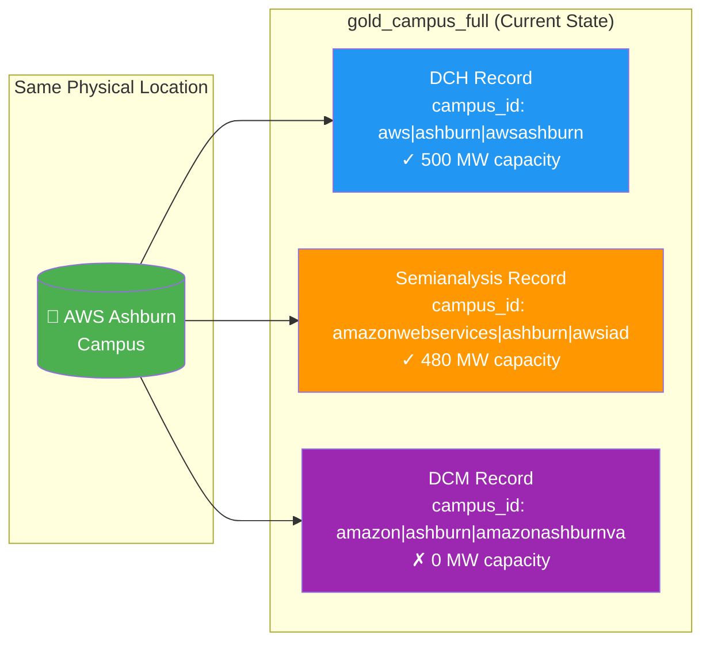
```mermaid
flowchart LR
    subgraph "Same Physical Location"
        A[("📍 AWS Ashburn<br/>Campus")]
    end

    subgraph "gold_campus_full (Current State)"
        B["DCH Record<br/>campus_id: aws|ashburn|awsashburn<br/>✓ 500 MW capacity"]
        C["Semianalysis Record<br/>campus_id: amazonwebservices|ashburn|awsiad<br/>✓ 480 MW capacity"]
        D["DCM Record<br/>campus_id: amazon|ashburn|amazonashburnva<br/>✗ 0 MW capacity"]
    end

    A --> B
    A --> C
    A --> D

    style A fill:#4CAF50,color:white
    style B fill:#2196F3,color:white
    style C fill:#FF9800,color:white
    style D fill:#9C27B0,color:white
```

**❌ Problem:** 3 records for 1 campus, no way to link them together!

---

## 2. The Solution: Universal Campus ID (UCID)

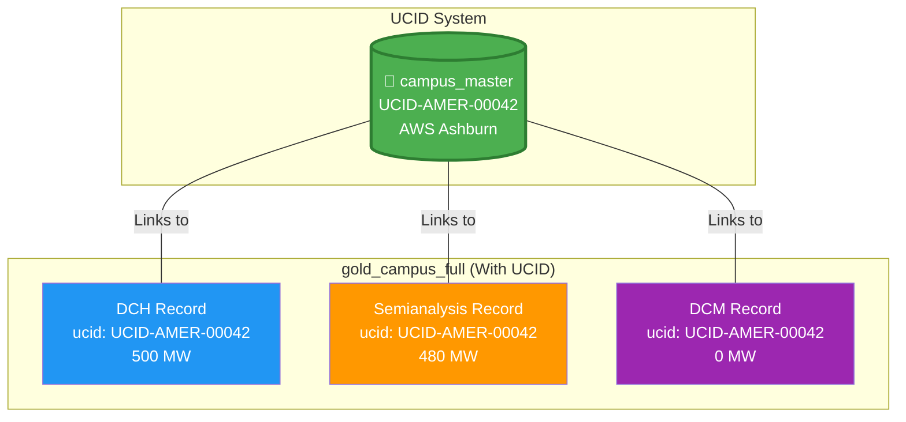
```mermaid
flowchart TB
    subgraph "UCID System"
        M[("🏢 campus_master<br/>UCID-AMER-00042<br/>AWS Ashburn")]
    end

    subgraph "gold_campus_full (With UCID)"
        B["DCH Record<br/>ucid: UCID-AMER-00042<br/>500 MW"]
        C["Semianalysis Record<br/>ucid: UCID-AMER-00042<br/>480 MW"]
        D["DCM Record<br/>ucid: UCID-AMER-00042<br/>0 MW"]
    end

    M ---|"Links to"| B
    M ---|"Links to"| C
    M ---|"Links to"| D

    style M fill:#4CAF50,color:white,stroke:#2E7D32,stroke-width:3px
    style B fill:#2196F3,color:white
    style C fill:#FF9800,color:white
    style D fill:#9C27B0,color:white
```

**✅ Solution:** All 3 records share `UCID-AMER-00042` — enabling cross-source comparison!

---

## 3. Distance Calculation: Why Haversine Matters

### The Problem with Euclidean Distance

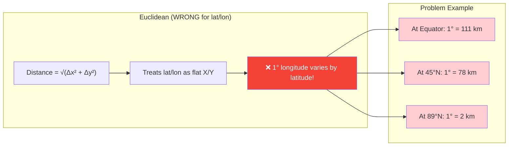
```mermaid
flowchart LR
    subgraph "Euclidean (WRONG for lat/lon)"
        E1["Distance = √(Δx² + Δy²)"]
        E2["Treats lat/lon as flat X/Y"]
        E3["❌ 1° longitude varies by latitude!"]
    end

    subgraph "Problem Example"
        P1["At Equator: 1° = 111 km"]
        P2["At 45°N: 1° = 78 km"]
        P3["At 89°N: 1° = 2 km"]
    end

    E1 --> E2 --> E3
    E3 --> P1 & P2 & P3

    style E3 fill:#f44336,color:white
    style P1 fill:#FFCDD2,color:#333
    style P2 fill:#FFCDD2,color:#333
    style P3 fill:#FFCDD2,color:#333
```

### The Solution: Haversine Distance

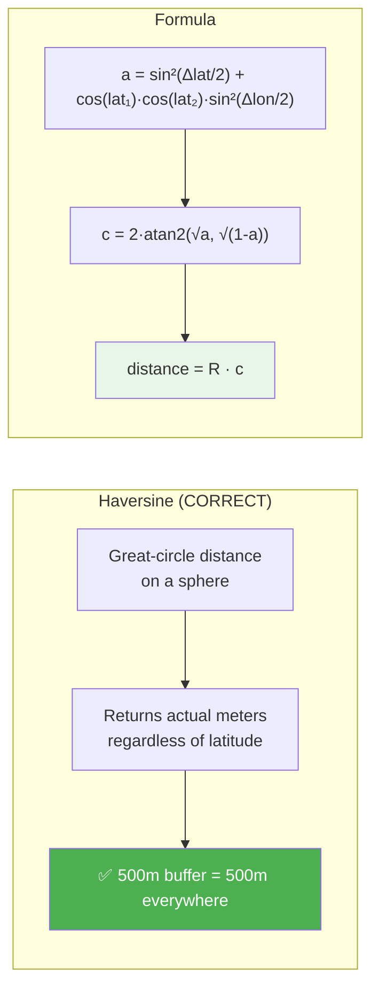
```mermaid
flowchart LR
    subgraph "Haversine (CORRECT)"
        H1["Great-circle distance<br/>on a sphere"]
        H2["Returns actual meters<br/>regardless of latitude"]
        H3["✅ 500m buffer = 500m everywhere"]
    end

    subgraph "Formula"
        F1["a = sin²(Δlat/2) + cos(lat₁)·cos(lat₂)·sin²(Δlon/2)"]
        F2["c = 2·atan2(√a, √(1-a))"]
        F3["distance = R · c"]
    end

    H1 --> H2 --> H3
    F1 --> F2 --> F3

    style H3 fill:#4CAF50,color:white
    style F3 fill:#E8F5E9,color:#333
```

### Visual Comparison

```
        EUCLIDEAN (Planar)              HAVERSINE (Spherical)

        ┌─────────────┐                        ___
        │             │                     .-'   '-.
        │  A────────B │                   .'    ⌢    '.
        │  straight   │                  /    A───B    \
        │  line       │                 |   great-circle|
        └─────────────┘                  \              /
                                          '.          .'
        Distance: √(Δx²+Δy²)                 '-.___..-'
        ❌ Wrong for lat/lon!
                                       Distance: 2R·arcsin(√a)
                                       ✅ Accounts for curvature
```

### Accuracy for UCID Matching

| Distance | Haversine Error* | For 250m Match | For 1000m Match |
|----------|------------------|----------------|-----------------|
| 100 m | < 0.1 m | ✅ Negligible | ✅ Negligible |
| 250 m | < 0.8 m | ✅ Negligible | ✅ Negligible |
| 500 m | < 1.5 m | ✅ Negligible | ✅ Negligible |
| 1 km | ~ 3 m | N/A | ✅ Negligible |

*Error vs geodesic (ellipsoid) calculation. Haversine assumes perfect sphere.

**Bottom Line:** For UCID matching at 250m-1000m scales, Haversine error is <3 meters — completely acceptable for campus clustering.

### Where It's Used

| Script | Function | Purpose |
|--------|----------|---------|
| `generate_text_ucid.py` | `haversine_distance()` | Cluster buildings into campuses |
| `compare_sa_vs_dch_v2.py` | `haversine_distance_m()` | Match SA ↔ DCH records |
| `campus_rollup_new.py` | `haversine_distance()` | Calculate campus centroids |

---

## 4. Clustering Methodology

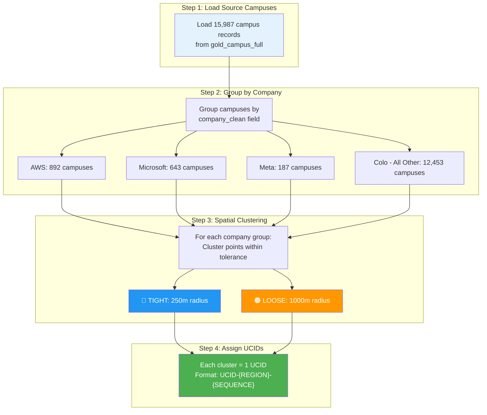
```mermaid
flowchart TD
    subgraph "Step 1: Load Source Campuses"
        A["Load 15,987 campus records<br/>from gold_campus_full"]
    end

    subgraph "Step 2: Group by Company"
        B["Group campuses by<br/>company_clean field"]
        B1["AWS: 892 campuses"]
        B2["Microsoft: 643 campuses"]
        B3["Meta: 187 campuses"]
        B4["Colo - All Other: 12,453 campuses"]
    end

    subgraph "Step 3: Spatial Clustering"
        C["For each company group:<br/>Cluster points within tolerance"]
        C1["🔵 TIGHT: 250m radius"]
        C2["🟠 LOOSE: 1000m radius"]
    end

    subgraph "Step 4: Assign UCIDs"
        D["Each cluster = 1 UCID<br/>Format: UCID-{REGION}-{SEQUENCE}"]
    end

    A --> B
    B --> B1 & B2 & B3 & B4
    B1 & B2 & B3 & B4 --> C
    C --> C1 & C2
    C1 & C2 --> D

    style A fill:#E3F2FD,color:#333
    style C1 fill:#2196F3,color:white
    style C2 fill:#FF9800,color:white
    style D fill:#4CAF50,color:white
```

---

## 4. TIGHT vs LOOSE Tolerance Comparison

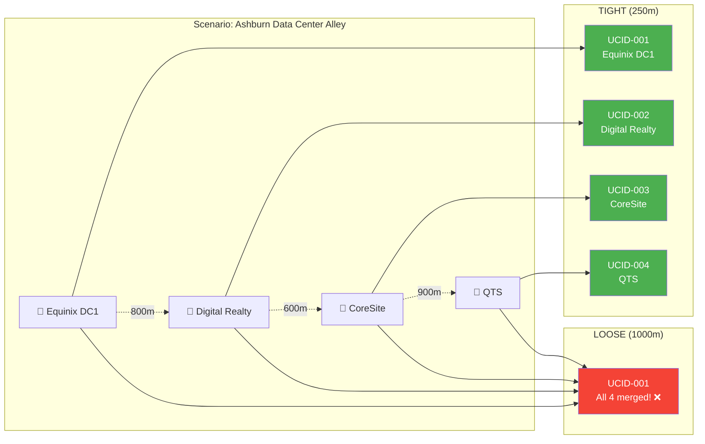
```mermaid
flowchart LR
    subgraph "Scenario: Ashburn Data Center Alley"
        direction TB
        P1["📍 Equinix DC1"]
        P2["📍 Digital Realty"]
        P3["📍 CoreSite"]
        P4["📍 QTS"]

        P1 -.->|"800m"| P2
        P2 -.->|"600m"| P3
        P3 -.->|"900m"| P4
    end

    subgraph "TIGHT (250m)"
        T1["UCID-001<br/>Equinix DC1"]
        T2["UCID-002<br/>Digital Realty"]
        T3["UCID-003<br/>CoreSite"]
        T4["UCID-004<br/>QTS"]
    end

    subgraph "LOOSE (1000m)"
        L1["UCID-001<br/>All 4 merged! ❌"]
    end

    P1 --> T1
    P2 --> T2
    P3 --> T3
    P4 --> T4

    P1 --> L1
    P2 --> L1
    P3 --> L1
    P4 --> L1

    style T1 fill:#4CAF50,color:white
    style T2 fill:#4CAF50,color:white
    style T3 fill:#4CAF50,color:white
    style T4 fill:#4CAF50,color:white
    style L1 fill:#f44336,color:white
```

**TIGHT correctly keeps 4 distinct colo facilities separate.**
**LOOSE incorrectly merges them into 1 campus.**

---

## 5. Validation Results

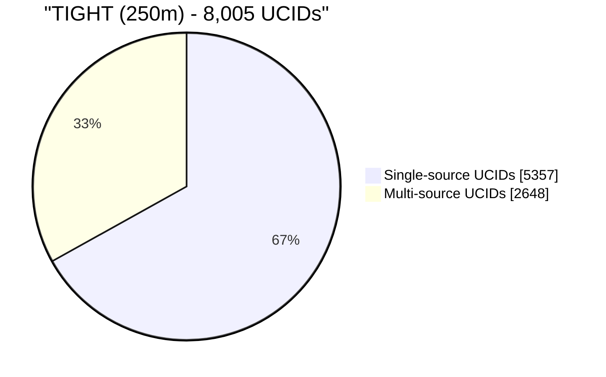
```mermaid
pie showData
    title "TIGHT (250m) - 8,005 UCIDs"
    "Single-source UCIDs" : 5357
    "Multi-source UCIDs" : 2648
```

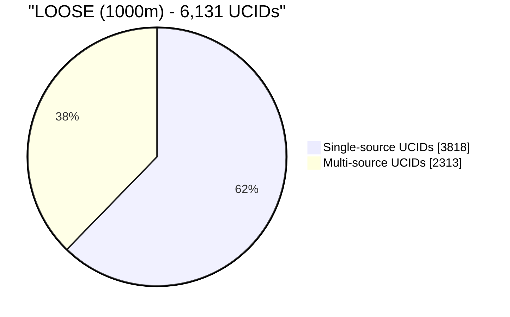
```mermaid
pie showData
    title "LOOSE (1000m) - 6,131 UCIDs"
    "Single-source UCIDs" : 3818
    "Multi-source UCIDs" : 2313
```

---

## 6. Key Findings: Why TIGHT Wins

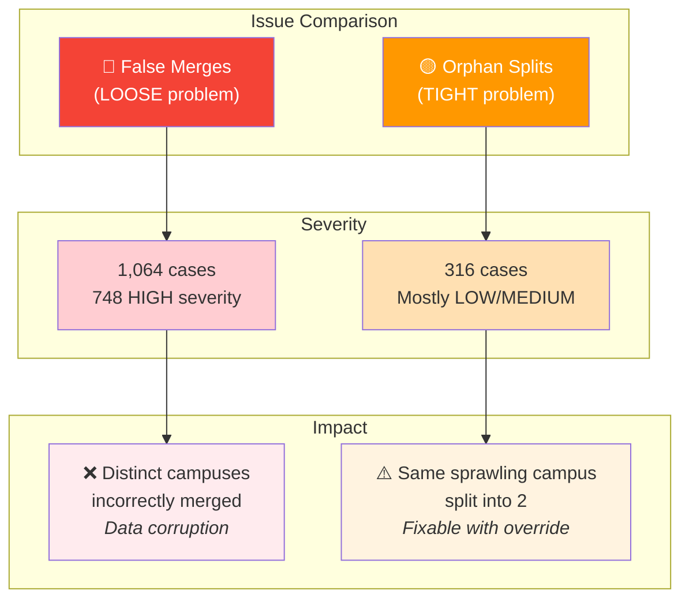
```mermaid
graph TB
    subgraph "Issue Comparison"
        direction LR
        A["🔴 False Merges<br/>(LOOSE problem)"]
        B["🟡 Orphan Splits<br/>(TIGHT problem)"]
    end

    subgraph "Severity"
        A1["1,064 cases<br/>748 HIGH severity"]
        B1["316 cases<br/>Mostly LOW/MEDIUM"]
    end

    subgraph "Impact"
        A2["❌ Distinct campuses<br/>incorrectly merged<br/><i>Data corruption</i>"]
        B2["⚠️ Same sprawling campus<br/>split into 2<br/><i>Fixable with override</i>"]
    end

    A --> A1 --> A2
    B --> B1 --> B2

    style A fill:#f44336,color:white
    style A1 fill:#FFCDD2,color:#333
    style A2 fill:#FFEBEE,color:#333
    style B fill:#FF9800,color:white
    style B1 fill:#FFE0B2,color:#333
    style B2 fill:#FFF3E0,color:#333
```

---

## 7. Meta Canonical Validation

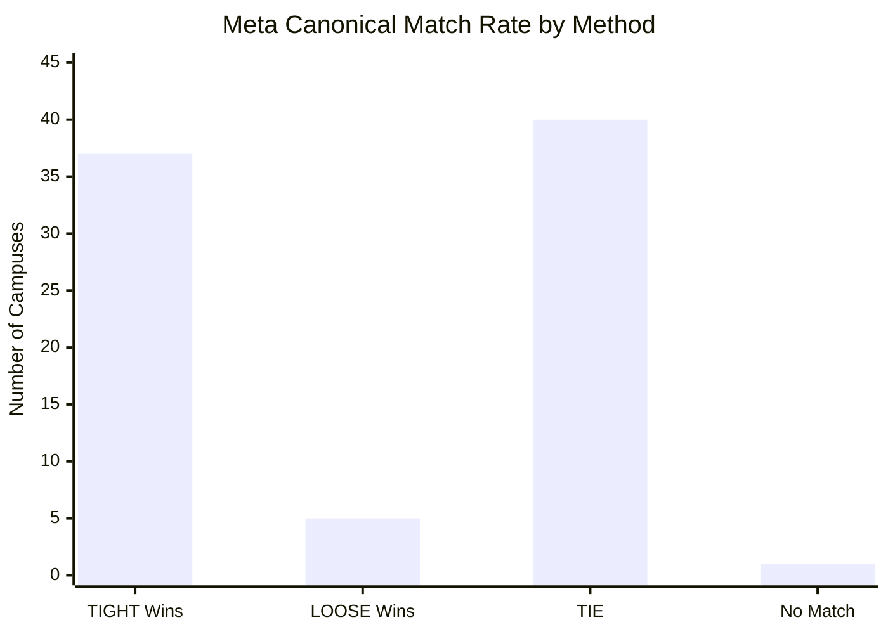
```mermaid
xychart-beta
    title "Meta Canonical Match Rate by Method"
    x-axis ["TIGHT Wins", "LOOSE Wins", "TIE", "No Match"]
    y-axis "Number of Campuses" 0 --> 45
    bar [37, 5, 40, 1]
```

**TIGHT matches Meta's ground truth 7.4x better than LOOSE!**

---

## 8. Dense Market Analysis (False Merge Hotspots)

| Market | TIGHT Clusters | LOOSE Merged To | Max Distance | Severity |
|--------|----------------|-----------------|--------------|----------|
| **Ashburn** | 13 | 1 | 5,757m | 🔴 HIGH |
| **Santa Clara** | 8 | 1 | 5,469m | 🔴 HIGH |
| **Hillsboro** | 15 | 1 | 4,511m | 🔴 HIGH |
| **Cyberjaya** | 11 | 1 | 4,371m | 🔴 HIGH |
| **Dallas** | 9 | 1 | 3,568m | 🔴 HIGH |

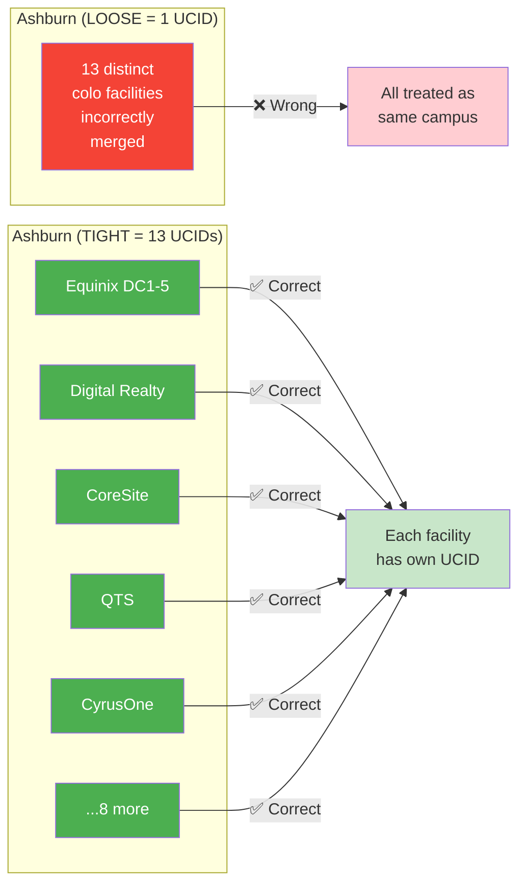
```mermaid
flowchart LR
    subgraph "Ashburn (LOOSE = 1 UCID)"
        A["13 distinct<br/>colo facilities<br/>incorrectly<br/>merged"]
    end

    subgraph "Ashburn (TIGHT = 13 UCIDs)"
        B1["Equinix DC1-5"]
        B2["Digital Realty"]
        B3["CoreSite"]
        B4["QTS"]
        B5["CyrusOne"]
        B6["...8 more"]
    end

    A -->|"❌ Wrong"| X["All treated as<br/>same campus"]
    B1 & B2 & B3 & B4 & B5 & B6 -->|"✅ Correct"| Y["Each facility<br/>has own UCID"]

    style A fill:#f44336,color:white
    style X fill:#FFCDD2,color:#333
    style B1 fill:#4CAF50,color:white
    style B2 fill:#4CAF50,color:white
    style B3 fill:#4CAF50,color:white
    style B4 fill:#4CAF50,color:white
    style B5 fill:#4CAF50,color:white
    style B6 fill:#4CAF50,color:white
    style Y fill:#C8E6C9,color:#333
```

---

## 9. Final Data Flow

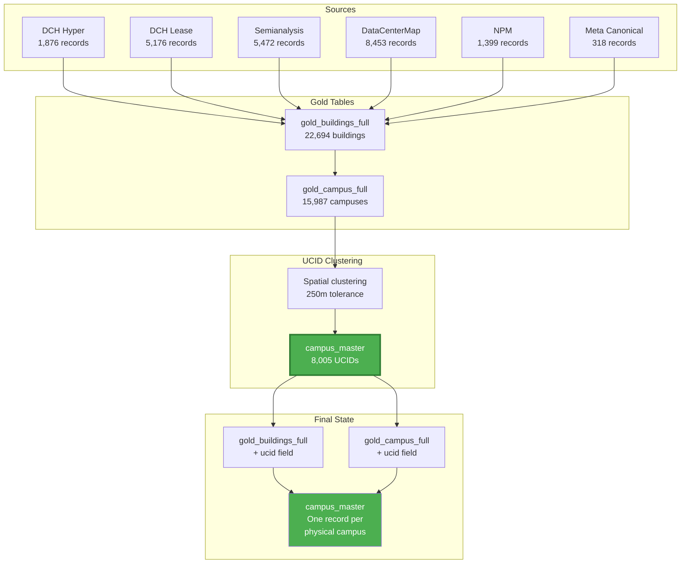
```mermaid
flowchart TD
    subgraph "Sources"
        S1["DCH Hyper<br/>1,876 records"]
        S2["DCH Lease<br/>5,176 records"]
        S3["Semianalysis<br/>5,472 records"]
        S4["DataCenterMap<br/>8,453 records"]
        S5["NPM<br/>1,399 records"]
        S6["Meta Canonical<br/>318 records"]
    end

    subgraph "Gold Tables"
        G1["gold_buildings_full<br/>22,694 buildings"]
        G2["gold_campus_full<br/>15,987 campuses"]
    end

    subgraph "UCID Clustering"
        U1["Spatial clustering<br/>250m tolerance"]
        U2["campus_master<br/>8,005 UCIDs"]
    end

    subgraph "Final State"
        F1["gold_buildings_full<br/>+ ucid field"]
        F2["gold_campus_full<br/>+ ucid field"]
        F3["campus_master<br/>One record per<br/>physical campus"]
    end

    S1 & S2 & S3 & S4 & S5 & S6 --> G1
    G1 --> G2
    G2 --> U1
    U1 --> U2
    U2 --> F2
    U2 --> F1
    F1 & F2 --> F3

    style U2 fill:#4CAF50,color:white,stroke:#2E7D32,stroke-width:3px
    style F3 fill:#4CAF50,color:white
```

---

## 10. UCID Format & Examples

```
UCID-{REGION}-{SEQUENCE}
     │          │
     │          └── 5-digit zero-padded number (00001-99999)
     │
     └── Region code: AMER, EMEA, APAC, OTHER
```

| UCID | Company | Location | Sources |
|------|---------|----------|---------|
| `UCID-AMER-00001` | Meta | Altoona, PA | DCH, Semianalysis, Meta Canonical |
| `UCID-AMER-00042` | AWS | Ashburn, VA | DCH, Semianalysis, DCM |
| `UCID-EMEA-00015` | Microsoft | Dublin, Ireland | DCH, Semianalysis |
| `UCID-APAC-00008` | Google | Singapore | DCH, DCM |

---

## 11. Use Cases Enabled by UCID

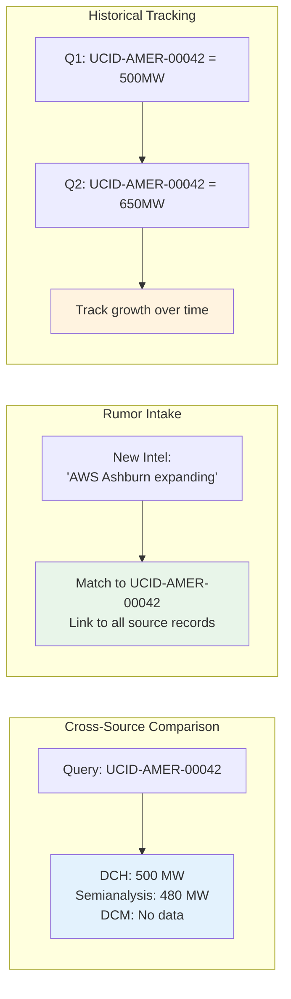
```mermaid
flowchart LR
    subgraph "Cross-Source Comparison"
        A["Query: UCID-AMER-00042"] --> B["DCH: 500 MW<br/>Semianalysis: 480 MW<br/>DCM: No data"]
    end

    subgraph "Rumor Intake"
        C["New Intel:<br/>'AWS Ashburn expanding'"] --> D["Match to UCID-AMER-00042<br/>Link to all source records"]
    end

    subgraph "Historical Tracking"
        E["Q1: UCID-AMER-00042 = 500MW"] --> F["Q2: UCID-AMER-00042 = 650MW"]
        F --> G["Track growth over time"]
    end

    style B fill:#E3F2FD,color:#333
    style D fill:#E8F5E9,color:#333
    style G fill:#FFF3E0,color:#333
```

---

## 12. Summary Statistics

| Metric | Value |
|--------|-------|
| **Total UCIDs (TIGHT)** | 8,005 |
| **Source Campus Records** | 15,987 |
| **Consolidation Ratio** | 2:1 (avg 2 source records per UCID) |
| **Multi-source UCIDs** | 2,648 (33.1%) |
| **Single-source UCIDs** | 5,357 (66.9%) |
| **False Merge Risk (TIGHT)** | Minimal |
| **Orphan Split Risk (TIGHT)** | 316 cases (fixable) |

---

## ✅ Recommendation

**Use TIGHT (250m) tolerance because:**

1. ✅ Prevents 748 high-severity false merges
2. ✅ Matches Meta Canonical 7.4x better than LOOSE
3. ✅ Preserves distinct colo facilities in dense markets
4. ✅ Orphan splits are rare and can be fixed with manual overrides

---

## 13. UCID Confidence Framework

Understanding how confident we can be in each UCID:

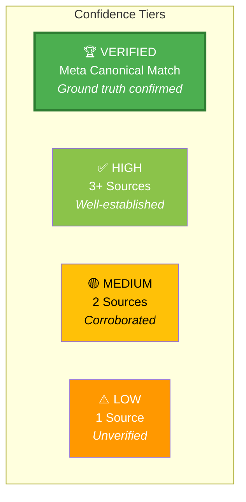
```mermaid
flowchart TD
    subgraph "Confidence Tiers"
        V["🏆 VERIFIED<br/>Meta Canonical Match<br/><i>Ground truth confirmed</i>"]
        H["✅ HIGH<br/>3+ Sources<br/><i>Well-established</i>"]
        M["🟡 MEDIUM<br/>2 Sources<br/><i>Corroborated</i>"]
        L["⚠️ LOW<br/>1 Source<br/><i>Unverified</i>"]
    end

    style V fill:#4CAF50,color:white,stroke:#2E7D32,stroke-width:3px
    style H fill:#8BC34A,color:white
    style M fill:#FFC107,color:black
    style L fill:#FF9800,color:white
```

### Confidence Tier Definitions

| Tier | Sources | Meaning | Reliability |
|------|---------|---------|-------------|
| **VERIFIED** | Meta Canonical match | Ground truth from internal data | 🟢 Highest |
| **HIGH** | 3+ independent sources | Multiple vendors agree | 🟢 Very High |
| **MEDIUM** | 2 independent sources | Cross-validated | 🟡 Good |
| **LOW** | 1 source only | Unverified, potential error | 🟠 Uncertain |

---

## 14. How Source Coverage Builds Confidence

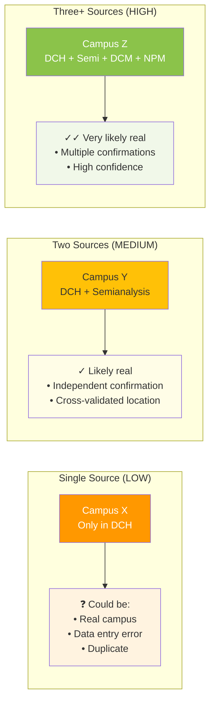
```mermaid
flowchart LR
    subgraph "Single Source (LOW)"
        A1["Campus X<br/>Only in DCH"]
        A2["❓ Could be:<br/>• Real campus<br/>• Data entry error<br/>• Duplicate"]
    end

    subgraph "Two Sources (MEDIUM)"
        B1["Campus Y<br/>DCH + Semianalysis"]
        B2["✓ Likely real<br/>• Independent confirmation<br/>• Cross-validated location"]
    end

    subgraph "Three+ Sources (HIGH)"
        C1["Campus Z<br/>DCH + Semi + DCM + NPM"]
        C2["✓✓ Very likely real<br/>• Multiple confirmations<br/>• High confidence"]
    end

    A1 --> A2
    B1 --> B2
    C1 --> C2

    style A1 fill:#FF9800,color:white
    style A2 fill:#FFF3E0,color:#333
    style B1 fill:#FFC107,color:#333
    style B2 fill:#FFFDE7,color:#333
    style C1 fill:#8BC34A,color:white
    style C2 fill:#F1F8E9,color:#333
```

---

## 15. Actual Confidence Distribution (December 2025)

Based on 8,005 UCIDs from TIGHT clustering:

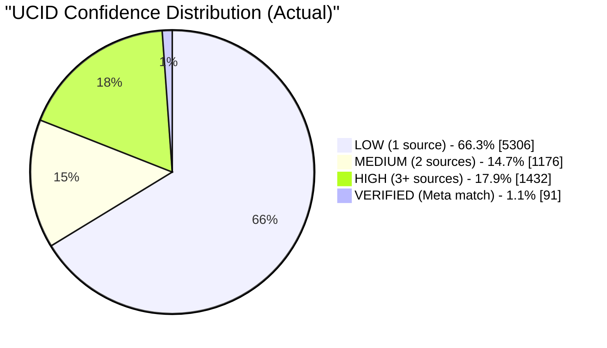
```mermaid
pie showData
    title "UCID Confidence Distribution (Actual)"
    "LOW (1 source) - 66.3%" : 5306
    "MEDIUM (2 sources) - 14.7%" : 1176
    "HIGH (3+ sources) - 17.9%" : 1432
    "VERIFIED (Meta match) - 1.1%" : 91
```

### Actual Metrics

| Tier | Count | % | Capacity (MW) | Meaning |
|------|-------|---|---------------|----------|
| **VERIFIED** | 91 | 1.1% | 35,362 | Meta ground truth match |
| **HIGH** | 1,432 | 17.9% | 194,864 | 3+ independent sources |
| **MEDIUM** | 1,176 | 14.7% | 222,765 | 2 independent sources |
| **LOW** | 5,306 | 66.3% | 375,339 | 1 source only (unverified) |
| **TOTAL** | 8,005 | 100% | 828,330 | |

### Key Insight
✅ **Multi-source rate: 2,699 / 8,005 = 33.7%**
→ One-third of campuses are independently corroborated

---

## 16. Actual Source Overlap (December 2025)

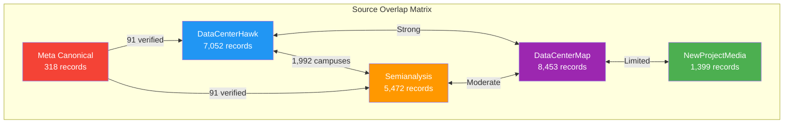
```mermaid
flowchart TD
    subgraph "Source Overlap Matrix"
        DCH["DataCenterHawk<br/>7,052 records"]
        SEMI["Semianalysis<br/>5,472 records"]
        DCM["DataCenterMap<br/>8,453 records"]
        NPM["NewProjectMedia<br/>1,399 records"]
        META["Meta Canonical<br/>318 records"]
    end

    DCH <-->|"1,992 campuses"| SEMI
    DCH <-->|"Strong"| DCM
    SEMI <-->|"Moderate"| DCM
    DCM <-->|"Limited"| NPM
    META -->|"91 verified"| DCH
    META -->|"91 verified"| SEMI

    style DCH fill:#2196F3,color:white
    style SEMI fill:#FF9800,color:white
    style DCM fill:#9C27B0,color:white
    style NPM fill:#4CAF50,color:white
    style META fill:#F44336,color:white
```

### Top Source Combinations (Actual)

| Source Combination | Count | % of Total | Quality |
|--------------------|-------|------------|----------|
| **DCH + DCM + Semianalysis** | 1,080 | 13.5% | 🏆 Best 3-way overlap |
| **DCH + Semianalysis** | 575 | 7.2% | 🟢 Strong pair |
| **DCH + DCM** | 327 | 4.1% | 🟢 Good coverage |
| **DCH + DCM + NPM + Semianalysis** | 303 | 3.8% | 🏆 4-source coverage! |
| **DCM + NPM** | 175 | 2.2% | 🟡 US-focused |
| **DCM + Semianalysis** | 90 | 1.1% | 🟡 Moderate |

### Key Finding
🔑 **DCH + Semianalysis overlap: 1,992 campuses** — your most valuable cross-validation pair

---

## 17. Actual Confidence by Company (December 2025)

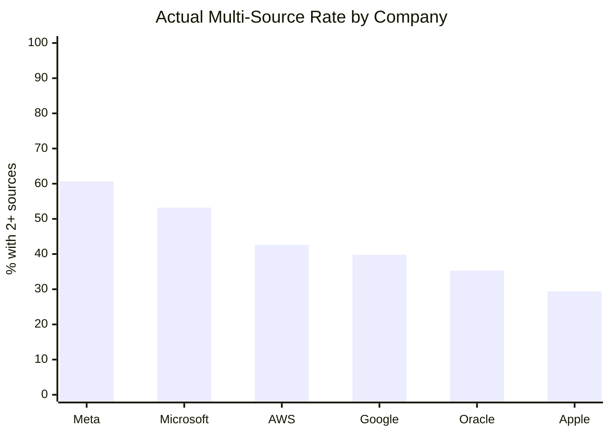
```mermaid
xychart-beta
    title "Actual Multi-Source Rate by Company"
    x-axis ["Meta", "Microsoft", "AWS", "Google", "Oracle", "Apple"]
    y-axis "% with 2+ sources" 0 --> 100
    bar [60.7, 53.2, 42.6, 39.8, 35.3, 29.4]
```

### Hyperscaler Confidence Breakdown (Actual)

| Company | Campuses | Verified | High | Medium | Low | Multi-Src% |
|---------|----------|----------|------|--------|-----|------------|
| **Meta** | 135 | 71 | 2 | 9 | 53 | **60.7%** |
| **Microsoft** | 248 | 1 | 46 | 85 | 116 | **53.2%** |
| **AWS** | 284 | 2 | 55 | 64 | 163 | **42.6%** |
| **Google** | 176 | 0 | 17 | 53 | 106 | **39.8%** |
| **Oracle** | 17 | 0 | 1 | 5 | 11 | **35.3%** |
| **Apple** | 17 | 0 | 2 | 3 | 12 | **29.4%** |
| **xAI** | 1 | 0 | 0 | 0 | 1 | **0%** |

### Why Hyperscalers Have Higher Confidence

1. **More newsworthy** → Covered by more vendors
2. **Larger facilities** → Easier to identify and track
3. **Public announcements** → More data points available
4. **Meta Canonical** → Internal validation for Meta campuses

### Why Colo Has Lower Confidence

1. **Thousands of small facilities** → Harder to track comprehensively
2. **Less public information** → Vendors have coverage gaps
3. **Frequent M&A** → Ownership changes cause confusion
4. **No internal ground truth** → Can't validate externally

---

## 18. Actionable Insights

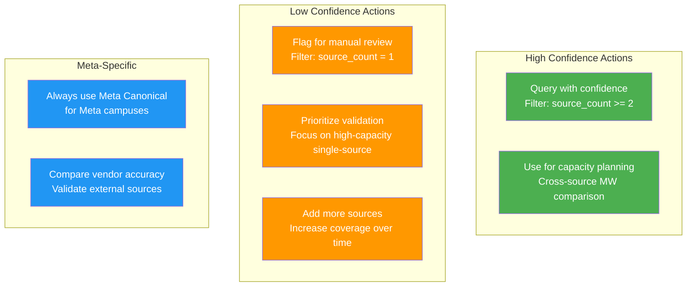
```mermaid
flowchart TD
    subgraph "High Confidence Actions"
        A1["Query with confidence<br/>Filter: source_count >= 2"]
        A2["Use for capacity planning<br/>Cross-source MW comparison"]
    end

    subgraph "Low Confidence Actions"
        B1["Flag for manual review<br/>Filter: source_count = 1"]
        B2["Prioritize validation<br/>Focus on high-capacity single-source"]
        B3["Add more sources<br/>Increase coverage over time"]
    end

    subgraph "Meta-Specific"
        C1["Always use Meta Canonical<br/>for Meta campuses"]
        C2["Compare vendor accuracy<br/>Validate external sources"]
    end

    style A1 fill:#4CAF50,color:white
    style A2 fill:#4CAF50,color:white
    style B1 fill:#FF9800,color:white
    style B2 fill:#FF9800,color:white
    style B3 fill:#FF9800,color:white
    style C1 fill:#2196F3,color:white
    style C2 fill:#2196F3,color:white
```

---

## 19. Confidence Analysis Script

Run this to get detailed confidence metrics:

```python
# In ArcGIS Pro Python window
exec(open(r"C:\Users\ptanderson\Documents\ArcGIS\Projects\Lean Consensus DC Model\scripts\06_ucid\analyze_ucid_confidence.py", encoding='utf-8').read())
```

### Output Files Generated

| File | Contents |
|------|----------|
| `ucid_confidence_full_*.csv` | All UCIDs with confidence tiers |
| `ucid_confidence_hyperscalers_*.csv` | Per-company confidence breakdown |
| `ucid_confidence_source_combos_*.csv` | Most common source combinations |
| `ucid_confidence_geography_*.csv` | Confidence by region/country |

---

## 20. Source Combination Analysis (Actual Data)

Where do single-source UCIDs come from?

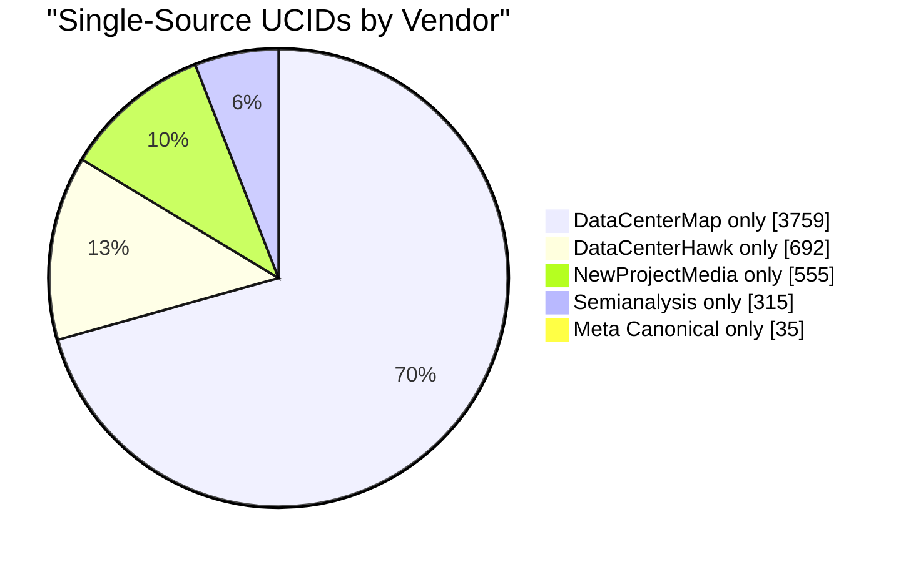
```mermaid
pie showData
    title "Single-Source UCIDs by Vendor"
    "DataCenterMap only" : 3759
    "DataCenterHawk only" : 692
    "NewProjectMedia only" : 555
    "Semianalysis only" : 315
    "Meta Canonical only" : 35
```

### Source Combination Breakdown

| Rank | Source Combination | Count | % | Confidence |
|------|-------------------|-------|---|------------|
| 1 | **DataCenterMap only** | 3,759 | 47.0% | 🟠 LOW |
| 2 | **DCH + DCM + Semianalysis** | 1,080 | 13.5% | ✅ HIGH |
| 3 | **DataCenterHawk only** | 692 | 8.6% | 🟠 LOW |
| 4 | **DCH + Semianalysis** | 575 | 7.2% | 🟡 MEDIUM |
| 5 | **NewProjectMedia only** | 555 | 6.9% | 🟠 LOW |
| 6 | **DCH + DCM** | 327 | 4.1% | 🟡 MEDIUM |
| 7 | **Semianalysis only** | 315 | 3.9% | 🟠 LOW |
| 8 | **DCH + DCM + NPM + Semianalysis** | 303 | 3.8% | 🏆 HIGHEST |
| 9 | **DCM + NPM** | 175 | 2.2% | 🟡 MEDIUM |
| 10 | **DCM + Semianalysis** | 90 | 1.1% | 🟡 MEDIUM |

### Key Finding
⚠️ **47% of UCIDs come from DataCenterMap alone** — broad location coverage but no capacity data

---

## 21. Geographic Confidence Analysis

```mermaid
xychart-beta
    title "Multi-Source Rate by Region"
    x-axis ["AMER", "OTHER", "APAC", "EMEA"]
    y-axis "% with 2+ sources" 0 --> 50
    bar [37.0, 32.7, 31.5, 30.0]
```

### Regional Breakdown (Actual)

| Region | Total UCIDs | Verified | High | Medium | Low | Multi-Src% |
|--------|-------------|----------|------|--------|-----|------------|
| **AMER** | 3,019 | 75 | 727 | 316 | 1,901 | **37.0%** |
| **OTHER** | 2,459 | 3 | 189 | 613 | 1,654 | **32.7%** |
| **APAC** | 1,149 | 5 | 249 | 108 | 787 | **31.5%** |
| **EMEA** | 1,377 | 7 | 267 | 139 | 964 | **30.0%** |

---

## 22. Country-Level Coverage

```mermaid
xychart-beta
    title "Top Countries by Multi-Source Rate"
    x-axis ["Japan", "S.Korea", "Canada", "Brazil", "Australia", "India", "USA", "UK", "Germany"]
    y-axis "% with 2+ sources" 0 --> 60
    bar [52.3, 48.6, 45.7, 44.4, 41.6, 39.8, 38.8, 34.9, 28.0]
```

### Top Countries by Confidence

| Country | Total | Multi-Src% | Coverage Quality |
|---------|-------|------------|------------------|
| **Japan** 🇯🇵 | 172 | 52.3% | 🟢 Excellent |
| **South Korea** 🇰🇷 | 74 | 48.6% | 🟢 Very Good |
| **Canada** 🇨🇦 | 197 | 45.7% | 🟢 Very Good |
| **Brazil** 🇧🇷 | 151 | 44.4% | 🟢 Good |
| **Australia** 🇦🇺 | 197 | 41.6% | 🟢 Good |
| **India** 🇮🇳 | 241 | 39.8% | 🟡 Moderate |
| **United States** 🇺🇸 | 3,126 | 38.8% | 🟡 Moderate (largest) |
| **United Kingdom** 🇬🇧 | 304 | 34.9% | 🟡 Moderate |
| **Germany** 🇩🇪 | 264 | 28.0% | 🟠 Below Average |

### ⚠️ Coverage Gaps

```mermaid
flowchart LR
    subgraph "Zero Multi-Source Coverage"
        CN["🇨🇳 China<br/>234 campuses<br/>0% multi-source"]
        RU["🇷🇺 Russia<br/>77 campuses<br/>0% multi-source"]
    end

    subgraph "Problem"
        P["All campuses from<br/>single vendor only<br/>→ Cannot validate"]
    end

    subgraph "Recommendation"
        R["Add regional data sources:<br/>• Chinese vendor data<br/>• Russian market reports"]
    end

    CN --> P
    RU --> P
    P --> R

    style CN fill:#f44336,color:white
    style RU fill:#f44336,color:white
    style P fill:#FFCDD2,color:#333
    style R fill:#4CAF50,color:white
```

| Country | Total | Multi-Src% | Issue |
|---------|-------|------------|-------|
| **China** 🇨🇳 | 234 | **0.0%** | ⛔ All single-source |
| **Russia** 🇷🇺 | 77 | **0.0%** | ⛔ All single-source |
| **Switzerland** 🇨🇭 | 90 | 18.9% | ⚠️ Low coverage |
| **Italy** 🇮🇹 | 161 | 21.7% | ⚠️ Low coverage |

---

## 23. Hyperscaler Capacity by Confidence Tier

```mermaid
xychart-beta
    title "Total Capacity by Hyperscaler (MW)"
    x-axis ["AWS", "Microsoft", "Google", "Meta", "Oracle", "xAI", "Apple"]
    y-axis "Capacity (MW)" 0 --> 100000
    bar [98050, 70258, 60390, 52161, 2570, 1680, 1258]
```

### Hyperscaler Detail (Actual Data)

| Company | Campuses | Verified | High | Medium | Low | Multi-Src% | Capacity (MW) |
|---------|----------|----------|------|--------|-----|------------|---------------|
| **AWS** | 284 | 2 | 55 | 64 | 163 | 42.6% | 98,050 |
| **Microsoft** | 248 | 1 | 46 | 85 | 116 | 53.2% | 70,258 |
| **Google** | 176 | 0 | 17 | 53 | 106 | 39.8% | 60,390 |
| **Meta** | 135 | 71 | 2 | 9 | 53 | 60.7% | 52,161 |
| **Oracle** | 17 | 0 | 1 | 5 | 11 | 35.3% | 2,570 |
| **xAI** | 1 | 0 | 0 | 0 | 1 | 0.0% | 1,680 |
| **Apple** | 17 | 0 | 2 | 3 | 12 | 29.4% | 1,258 |
| **Alibaba** | 7 | 0 | 0 | 0 | 7 | 0.0% | 0 |

### Key Observations

1. **Meta leads in verification** — 71 of 135 campuses (53%) are VERIFIED through Meta Canonical
2. **Microsoft has best external multi-source rate** — 53.2% without internal ground truth
3. **AWS has most campuses** but only 42.6% multi-source coverage
4. **Alibaba has zero capacity data** — only location coverage from single source

---

## 24. Key Takeaways & Recommendations

```mermaid
flowchart TD
    subgraph "Current State"
        A["8,005 unique campuses identified"]
        B["33.7% have 2+ source coverage"]
        C["66.3% are single-source (unverified)"]
    end

    subgraph "Strengths"
        S1["✅ DCH + Semianalysis overlap: 1,992 campuses"]
        S2["✅ 303 campuses have 4-source coverage"]
        S3["✅ Meta: 60.7% verified/multi-source"]
    end

    subgraph "Gaps to Address"
        G1["⚠️ China & Russia: 0% multi-source"]
        G2["⚠️ 47% of UCIDs from DCM only (no capacity)"]
        G3["⚠️ Alibaba: 0 MW capacity data"]
    end

    subgraph "Recommendations"
        R1["Add Chinese regional data source"]
        R2["Prioritize capacity data for DCM-only sites"]
        R3["Focus validation on high-capacity LOW tier"]
    end

    A --> B --> C
    B --> S1 & S2 & S3
    C --> G1 & G2 & G3
    G1 --> R1
    G2 --> R2
    G3 --> R3

    style A fill:#2196F3,color:white
    style B fill:#4CAF50,color:white
    style C fill:#FF9800,color:white
    style S1 fill:#C8E6C9,color:#333
    style S2 fill:#C8E6C9,color:#333
    style S3 fill:#C8E6C9,color:#333
    style G1 fill:#FFCDD2,color:#333
    style G2 fill:#FFCDD2,color:#333
    style G3 fill:#FFCDD2,color:#333
    style R1 fill:#E3F2FD,color:#333
    style R2 fill:#E3F2FD,color:#333
    style R3 fill:#E3F2FD,color:#333
```

### Summary Statistics

| Metric | Value |
|--------|-------|
| **Total UCIDs** | 8,005 |
| **Multi-source rate** | 33.7% (2,699 UCIDs) |
| **Highest confidence** | 303 campuses with 4 sources |
| **Best source pair** | DCH + Semianalysis (1,992 overlap) |
| **Best hyperscaler coverage** | Meta (60.7% multi-source) |
| **Largest coverage gap** | China (234 campuses, 0% multi-source) |
| **Total capacity tracked** | 828,330 MW |

---

*Generated: December 19, 2025*
